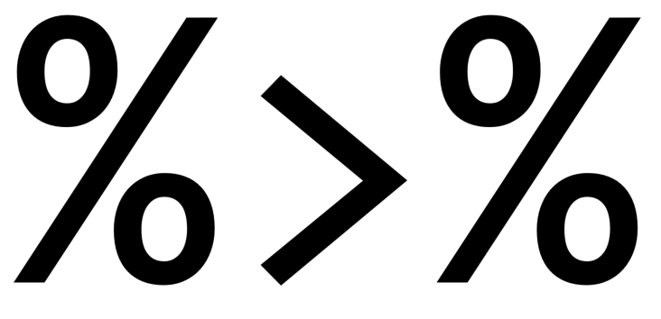

```{r setup, include=FALSE}
knitr::opts_chunk$set(echo = FALSE)
```

```{r load libraries, message=FALSE, warning=FALSE, include=FALSE}
library(tidyverse)
library(glmnet)
library(caret)
```

## Overview

- Why should I care about functional programming or `purrr`?
- What can I do with these tools?
- Where can I learn more?

<div class="notes">
The structure for this session will be to answer three questions …
</div>

# Why should I care?

## Three ideas

1. The easier code is to understand, the better.
2. The easier code is to reuse and adapt, the better.
3. The more reliable my results from code, the better.

<div class="notes">
Here are three ideas about code that hopefully won't be too controversial …

Caveat: no, using `purrr` and functional programming isn't the only way to achieve clean and reusable code, but it is one way, and it has a lot of strengths. 

Caveat 2: Yes you can do functional programming without `purrr`, and it's often the right choice. But `purrr` gives you loads of freebies that make things easier, and is more reliable in ways that make it great to use.

Addressing these three points will hopefully convince you that you should care. Before we get going in earnest though I need to talk briefly about two things at the centre of this talk …
</div>

## Functions {.build}

```{r create square, echo=TRUE}
square <- function(x) {
    return(x^2)
}
```

<div class="notes">
What is a function?

Code that takes in some number of inputs, does stuff, then returns some number of outputs.

This is how you most often define a function in R.
</div>

## Functions {.build}

```{r apply square 2, echo=TRUE}
square(c(1, 2, 3, 4, 5))
```

<div class="notes">
Here I call the function on a vector of numbers, 

And the result is as expected.

Note though that this won't work if those same numbers are stored in a list, for which we need some sort of iteration, which we'll see in a bit.

But before that, a word on our second star of the show ……
</div>

## The Pipe {.flexbox .vcenter}



<div class="notes">
Many of you will already know about the `%>%` operator. Read it as: 

"Take the output from whatever was on the left, and let it be the first argument to the function on the right".

It allows code to be read from left to right, top to bottom, instead of nesting function calls. 

For anyone that's used a Unix command line it's very similar to the `|` operator.
</div>

## The Pipe

```{r pipe to square, echo=TRUE}
c(1, 2, 3, 4, 5) %>% 
    square()
```

<div class="notes">
Pipe a vector into `square()` and it gives the expected result.

I haven't really made the case yet for the pipe, and you probably wouldn't bother using it here. As we go along hopefully the case for the pipe will be more convincing.

Now let's get back to those three principles I mentioned earlier.
</div>

# The easier code is to understand, the better

## What is Functional Programming? {.build}

### Functional Programming …

> … treats computation as the evaluation of mathematical functions …

> … avoids changing state and side effects …

> … avoids mutable data …

<div class="notes">
[Talk through the definition.]

The aim is to write code that works like a simple machine: take inputs, do stuff only to those inputs, then return some sort of value. 
</div>

## The easier code is to understand, the better {.build}

```{r map function, echo=TRUE, eval=FALSE}
map()
```


<div class="notes">
`purrr` is a software library with tools for functional programming. Often this is for iteration, as an alternative to loops.

The workhorse is the `map()` function:
</div>

## The easier code is to understand, the better

```{r map with list, echo=TRUE, eval=FALSE}
map(list(1, 2, 3, 4, 5))
```

<div class="notes">
Take a list or vector
</div>

## The easier code is to understand, the better

```{r map with list and func, echo=TRUE, eval=FALSE}
map(list(1, 2, 3, 4, 5), square)
```

<div class="notes">
Apply some function to each element
</div>

## The easier code is to understand, the better

```{r run map on list, echo=TRUE}
map(list(1, 2, 3, 4, 5), square)
```

<div class="notes">
Then return the result.

This still looks a bit like overkill for a fairly simple problem, but it looks more useful if you have a list with elements of different lengths 
</div>

## The easier code is to understand, the better {.build}

```{r run map on list different lengths, echo=TRUE}
list(c(1), 
     c(2, 3, 4), 
     c(5, 6)) %>% 
    map(square)
```

<div class="notes">
As you can see here. It preserves the structure of the input.

The code is clear and easy to understand: you can see what the inputs are, and what it will do to them. 
</div>

# The easier code is to reuse and adapt, the better

<div class="notes">
Wrapping code inside a function allows it to be reused and adapted easily.

Here's an example I've 'borrowed' from Hadley Wickham's book, Advanced R.
</div>

## The easier code is to reuse and adapt, the better

```{r sample data, echo=TRUE}
# Generate a sample dataset
set.seed(1014)
df <- data.frame(replicate(6, sample(c(1:10, -99), 6, rep = TRUE)))
names(df) <- letters[1:6]
df
```

Source: [Hadley Wickham, Advanced R][adv_r_fp_ex]

<div class="notes">
You have data where missing values have been coded as `-99`, and you want to replace them all with `NA`.
</div>

## The easier code is to reuse and adapt, the better

```{r error prone recoding, echo=TRUE, eval=FALSE}
df$a[df$a == -99] <- NA
df$b[df$b == -99] <- NA
df$c[df$c == -98] <- NA
df$d[df$d == -99] <- NA
df$e[df$e == -99] <- NA
df$f[df$g == -99] <- NA
```

<div class="notes">
Doing this with copy paste operations like this is error prone. 

There are two errors on here that you might spot, or might not.

A better approach is just to define the operation you want to happen, then apply it consistently.
</div>

## The easier code is to reuse and adapt, the better

```{r better recoding, eval=FALSE, echo=TRUE}
fix_missing <- function(x) {
    x[x == -99] <- NA
    x
}
df$a <- fix_missing(df$a)
df$b <- fix_missing(df$b)
df$c <- fix_missing(df$c)
df$d <- fix_missing(df$d)
df$e <- fix_missing(df$e)
df$f <- fix_missing(df$e)
```

<div class="notes">
This is better, but it still leaves room for error.

We can use `map()` to make this simpler and more reliable.
</div>

## The easier code is to reuse and adapt, the better {.build}

```{r best recoding, echo=TRUE}
fix_missing <- function(x) {
    x[x == -99] <- NA
    x
}

df %>% 
    map(fix_missing)
```

<div class="notes">
Now the whole `data.frame` is handled at once.

But `map()` will only ever return a list, so to get back to a `data.frame` we need one extra step …
</div>

## The easier code is to reuse and adapt, the better

```{r best recoding to df, echo=TRUE}
df %>% 
    map(fix_missing) %>% 
    as.data.frame()
```

<div class="notes">
Just add another pipe, stick `as.data.frame()` on the end of the chain, and now the output is a `data.frame` as desired. 

There's no limit to the number of pipes you can chain together, and being able to successively apply functions like this allows you to do really complex things in a clear and consistent way.
</div>

# The more reliable my results from code, the better

## Question …

<div class="centered">
#### Do you expect code to give the same results every time?
</div>

<div class="notes">
This is true for functions like `square()` from earlier on. Those functions, whose outputs rely only on their inputs, are called **pure functions**. But what about …
</div>

## Impure Functions 

### `Sys.Date()`
### `rnorm(1)`
### `plot()`

<div class="notes">
All of these either rely on, or change, the state of the environment in which they are called. They are called **impure functions**. 

Despite the judgmental-sounding name that doesn't make them bad: they are indispensable! (You'll see that in the example later on.) But it means we have to be extra careful when using them for programming.
</div>

## The more reliable my results from code, the better {.build}

```{r best recoding and assign to new var, echo=TRUE}
clean_df <- df %>% 
    map(fix_missing) %>% 
    as.data.frame()
clean_df
```
<div class="notes">
I mentioned earlier that functional programming modifying objects in place.

Here we pass the object into a series of functions and assign the output to a new name.

Hopefully by now you can see why you should care!
</div>

# What can we do with these tools?

<div class="notes">
There an awful lot to  to `purrr`: far more than I can properly cover in this session. So to keep to a sensible time I'm going to switch to an example of using `purrr` and functional programming for something closer to real work.
</div>

## The German Credit Dataset

```{r read data, echo=TRUE}
d <- read_rds("./data/clean/german_credit_cleaned.rds")
head(d) %>% 
    select(acct_status, duration, outcome) %>% 
    knitr::kable()
```

<div class="notes">
We will try to predict credit default using the German credit dataset, which is open-source. Where outcome is good the customer paid off in full, bad means default.

I've already done the cleaning and recoding.
</div>

## `glmnet`

- Standard logistic regression, plus …
- A penalty for considering variables to be too important.
- Helps the model to generalise to new data.

<div class="notes">
I'll be using a regularised logistic regression via the `glmnet` package. Which means …

Regularised just means that the model adds a penalty for giving more importance to the variables when making predictions. 

It's a way of helping to generalise the model by reducing overfitting.
</div>

## `glmnet` {.build}

### Two elements to the penalty

1. `lambda`: the **strength** of the penalty
2. `alpha`: the **type** of penalty

Want to:

- Test $\alpha = \{0.0, 0.05, 0.10, ... , 1.0\}$, and
- Have the results in a useful format.

We will do this with functional programming and `purrr`!

<div class="notes">
glmnet will automatically optimise the strength of the penalty for us if we want it to, so let's put that to one side for now.

However we have to pick a value for alpha, which can range from 0 to 1.

0 means completely one type, 1 means completely the other, and anything between is a mix of the two.

(I'm skating over a lot of the finer points to focus more on the functional programming elements.)

The term for alpha and lambda is hyperparameters. There's no way to know just by looking at the dataset what value will be best for them. So we have to test.
</div>

## Data Loading and Partition

```{r data prep and partition 1, echo=TRUE}
X <- model.matrix(outcome ~ 0 + ., 
                  data = d) %>% 
    scale()
y <- if_else(d$outcome == "bad", 1L, 0L)
```

<div class="notes">
glmnet only accepts numeric type inputs, so the first step is to turn our tibble, `d`, into a matrix.

Notice though that we can pipe a matrix into a function: in this case to scale all of the predictors so that they have a mean of 0 and variance 1. You can use the pipe without `purrr`, and vice versa.
</div>

## Data Loading and Partition

```{r data prep and partition 2, echo=TRUE}
random_seed <- 1054
set.seed(random_seed)
train_idx <- createDataPartition(y, 
                                 p = 0.8, 
                                 list = FALSE)
Xtrain <- X[train_idx, ]
Xtest <- X[-train_idx, ]
ytrain <- y[train_idx]
ytest <- y[-train_idx]
```

<div class="notes">
Best practice is to use different datasets for training and evaluating the model, so here we reserve 20% of the data for evaluation.

Note here that we set a random seed that will be used by `createDataPartition()`, which makes everything reproducible. So `createDataPartition()` is an impure function.
</div>

## Data Loading and Partition

```{r data prep and partition 3, echo=TRUE}
set.seed(random_seed)
cv_folds <- createFolds(ytrain, 
                        k = 10, 
                        list = FALSE)
head(cv_folds)
```

<div class="notes">
And then within the training data we will use cross-validation to select the best values for our hyperparameters. This step identifies which rows of the dataset will appear in which folds.
</div>

## Model Training {.build}

```{r model training 1, echo=TRUE}
tibble(alpha = seq(0, 1, 0.05))
```

<div class="notes">
Start off with the values we want to use for alpha
</div>

## Model Training {.build}

```{r model training 2, echo=TRUE, warning=FALSE}
trained_models <- tibble(
    alpha = seq(0, 1, 0.05)
) %>% 
    mutate(model = map(alpha, 
                       ~ cv.glmnet(Xtrain, 
                                   ytrain, 
                                   family = "binomial", 
                                   foldid = cv_folds, 
                                   alpha = .x)))
trained_models
```

<div class="notes">
This step actually builds the model.

[Walk through the code, including the use of the mapper and `.x`]

Note the list column in the output, which is because we used `map()`.

All the models are stored in one place, and the alpha column is a bit like metadata for the models, so we don't need to look inside each one to see how it was trained.
</div>

## Training Results

### To get results we need:

- A way to measure prediction error;
- To tell `glmnet` which value of `lambda` to use: 
- `"lambda.min"`, or 
- `"lambda.1se"`

<div class="notes">
lambda.min is the one that got the absolute best results in model training.

lambda.1se is the highest value of lambda whose error was within 1 standard error of the minimum.

Suppose we want to get both?
</div>

## Training Results

### Build up the results step by step

```{r train results 1, echo=TRUE, eval=FALSE}
c("lambda.min", "lambda.1se") %>% 
    map(~ trained_models)
```

<div class="notes">
Start by piping the vector into `map()`. The function starts off with the tibble of trained models.
</div>

## Training Results

```{r train results 2, echo=TRUE}
c("lambda.min", "lambda.1se") %>% 
    map(~ trained_models %>% 
            mutate(lambda = .x))
```

<div class="notes">
Note that the output is a list of tibbles, which we don't really want. 
</div>

## Training Results

```{r train results 3, echo=TRUE}
c("lambda.min", "lambda.1se") %>% 
    map_dfr(~ trained_models %>% 
                mutate(lambda = .x))
```

<div class="notes">
Instead use `map_dfr()` to have `purrr` bind the elements of the list together as a single tibble of 42 rows. Can do this to return an output of whatever type you like. However …
</div>

## `purrr` type error

```{r train results 3b, echo=TRUE, error=TRUE}
c("lambda.min", "lambda.1se") %>% 
    map_int(~ trained_models %>% 
                mutate(lambda = .x))
```

<div class="notes">
If I ask `purrr` to create an integer vector from the output it throws an error. It won't coerce types, it won't combine elements of different types. Just throws an informative error. 
</div>

## `purrr` type error {.build}

```{r type error, echo=TRUE, error=TRUE}
list(c(1, 2, 3), 
     c(4, 5), 
     c(6)) %>% 
    map_dbl(max)

list(c(1, 2, 3), 
     c(4, 5), 
     c(6)) %>% 
    map_int(max)
```

<div class="notes">
Even a really simple thing, like changing a double to an integer, will throw an error. 

This makes purrr sound like a prima donna, but this means you have high confidence in the outputs: you avoid silent failures, and if your code fails you can more easily trace how and why it happened. This is where it differs from some of the `*apply()` family, particularly `sapply()`. This is the difference in reliability that I alluded to earlier. You don't know for sure what the type of the output from `sapply()` will be.

Back to our example …
</div>

## Training Results

```{r train results 4, echo=TRUE}
c("lambda.min", "lambda.1se") %>% 
    map_dfr(
        ~ trained_models %>% 
            mutate(lambda = .x) %>% 
            mutate(train_preds = map2(model, 
                                      lambda, 
                                      ~ predict(.x, 
                                                newx = Xtrain, 
                                                type = "response", 
                                                s = .y)))
    )
```

<div class="notes">
Walk through the code.

Note use of `map2()` to work with two lists at once.

Now we need the error metric. Could just add the code in another call to `mutate()` at the end of this chain. But this session is about functions!
</div>

## Error Function

```{r deviance function, echo=TRUE}
binom_deviance <- function(pred, 
                           actual) {
    mean(2 * (dplyr::coalesce(actual * log(actual/pred), 0) + 
                  dplyr::coalesce((1 - actual) * 
                                      log((1 - actual)/(1 - pred)), 
                                  0)))
}
```

<div class="notes">
Build a function to calculate binomial regression deviance. 

Because `coalesce()` is part of the `dplyr` package I add `dplyr::` in front of it: that means the function will work even if `dplyr` isn't loaded. (Although it does have to be installed.)
</div>

## Training Results

```{r train results 5, echo=TRUE}
train_results <- c("lambda.min", "lambda.1se") %>% 
    map_dfr(
        ~ trained_models %>% 
            mutate(lambda = .x) %>% 
            mutate(train_preds = map2(model, 
                                      lambda, 
                                      ~ predict(.x, 
                                                newx = Xtrain, 
                                                type = "response", 
                                                s = .y))) %>% 
            mutate(train_dev = map_dbl(train_preds, 
                                       binom_deviance, 
                                       actual = ytrain))
    )
```

<div class="notes">
Then just map that function on to the predictions. See at the end I can pass the extra argument for the actual values as an extra named argument. In this case it's easier than using a mapper.
</div>

## Training Results

```{r train results 6, echo=TRUE}
train_results
```

<div class="notes">
Here are the results. But you may be wondering:

**Why bother with all of this?**

(Especially if you've heard of the `caret` package!)

For one thing it makes it easy to work with our results. Suppose we want to plot the training error …
</div>

## Plot training error

```{r plot training error code, echo=TRUE, eval=FALSE}
train_results %>% 
    ggplot(aes(alpha, train_dev, colour = lambda)) + 
    geom_point(size = 2) + 
    scale_colour_viridis_d(end = 0.7, 
                           option = "B") + 
    scale_y_continuous("Mean Training Deviance") + 
    scale_x_continuous(expression(alpha), 
                       breaks = c(0, 0.5, 1), 
                       labels = c("Ridge", "Elastic", "LASSO")) + 
    ggtitle("Training Error by Penalty Type", 
            subtitle = "LASSO, Ridge, Elastic Net Regression") + 
    theme_classic() + 
    theme(legend.title = element_blank())
```

<div class="notes">
I can just pass `train_results` into `ggplot()` and get a plot.
</div>

## Plot training error

```{r plot training error figure}
train_results %>% 
    ggplot(aes(alpha, train_dev, colour = lambda)) + 
    geom_point(size = 2) + 
    scale_colour_viridis_d(end = 0.7, 
                           option = "B") + 
    scale_y_continuous("Mean Training Deviance") + 
    scale_x_continuous(expression(alpha), 
                       breaks = c(0, 0.5, 1), 
                       labels = c("Ridge", "Elastic", "LASSO")) + 
    ggtitle("Training Error by Penalty Type", 
            subtitle = "LASSO, Ridge, Elastic Net Regression") + 
    theme_classic() + 
    theme(legend.title = element_blank())
```

<div class="notes">
Because the results are in a tibble getting this plot is easy.

It also means we can do all the usual operations on the tibble, like filtering, which brings us on to selecting a model.

Let's be conservative about these results and go with the value of alpha that gives the best results with lambda.1se, and check its performance on the test dataset. Remember that lambda.1se has a stronger penalty, so it _should_ generalise better than the minimum.

And **purely for comparison** we will also look at the same value of alpha with lambda.min. (Would never do this on a real problem: you can't choose models based on the test results!)
</div>

## Test Results {.build}

```{r best alpha, echo=TRUE}
best_alpha <- train_results %>% 
    filter(lambda == "lambda.1se") %>% 
    top_n(n = 1, wt = -train_dev) %>% 
    pull(alpha)
best_alpha
```

<div class="notes">
Here we pull out the value of alpha that gave the best results on "lambda.1se"
</div>

## Test Results

```{r test results 1, echo=TRUE}
test_results <- train_results %>% 
    filter(alpha == best_alpha) %>% 
    mutate(test_preds = map2(model, 
                             lambda, 
                             ~ predict(.x, 
                                       newx = Xtest, 
                                       type = "response", 
                                       s = .y))) %>% 
    mutate(test_dev = map_dbl(test_preds, 
                              binom_deviance, 
                              actual = ytest))
```

<div class="notes">
Now get predictions just as we did earlier, then compute the deviance. 
</div>

## Test Results

```{r test results 2, echo=TRUE}
test_results %>% 
    select(lambda, train_dev, test_dev, everything())
```

<div class="notes">
You can see that the gap has narrowed between the two from training to test, which is what we expected. 
</div>

## Plot Test Results

```{r plot test results}
test_results %>% 
    mutate(lambda = factor(lambda)) %>% 
    ggplot(aes(lambda, test_dev, colour = lambda)) + 
    geom_point(size = 4) + 
    scale_colour_viridis_d(end = 0.7, 
                           option = "B") + 
    scale_y_continuous("Test Data Deviance") + 
    ggtitle("Training Error by lambda Value") + 
    theme_classic() + 
    theme(legend.title = element_blank()) + 
    coord_flip(ylim = c(0.92, 1.1))
```

<div class="notes">
The gap between the test error for the two values for lambda has basically vanished. We were right to be cautious!
</div>

# Where next?

## Where next with `purrr` and Functional Programming?

- To learn about `purrr`: [Jenny Bryan's tutorials][JB_purrr]
- For more on FP in R: [Hadley Wickham's Advanced R][adv_r]
- Further reading on FP Principles: [Structure and Interpretation of Computer Programs][SICP], AKA _The Wizard Book_
- This presentation available at [GitHub][GH_repo]

# Thank you

[adv_r_fp_ex]: http://adv-r.had.co.nz/Functional-programming.html#fp-motivation
[JB_purrr]: https://jennybc.github.io/purrr-tutorial/
[DC_basic]: https://www.datacamp.com/courses/foundations-of-functional-programming-with-purrr
[DC_intermediate]: https://www.datacamp.com/courses/intermediate-functional-programming-with-purrr
[tidy_ML]: https://www.datacamp.com/courses/machine-learning-in-the-tidyverse
[adv_r]: http://adv-r.had.co.nz/
[SICP]: https://web.mit.edu/alexmv/6.037/sicp.pdf
[GH_repo]: https://github.com/hamedbh/func-prog